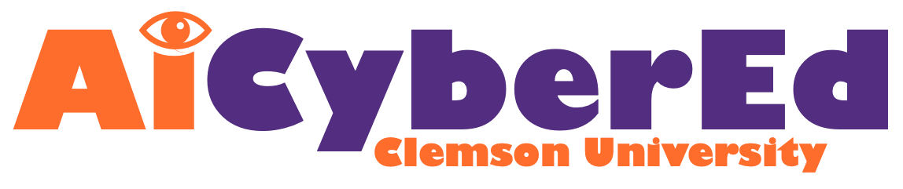

### Team Members:
- PI: Nicole Bannister, Associate Professor in the College of Education 
- Co PI: Bart Knijnenburg, Associate Professor in Human-Centered Computing
- Co PI: Kelly Caine, Associate Professor in Human-Centered Computing
- Khushbu Singh, PhD Student in Education
- Sushmita Khan, PhD Student in Human-Centered Computing
- Mehtab Iqbal, Phd Student in Human-Centered Computing
- Kyra Derrick, Undergraduate Student
- Philip Nelson, Undergraduate Student
- Channing Smith, Undergraduate Student

-
